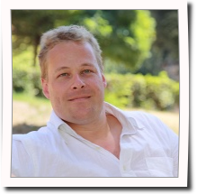
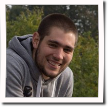
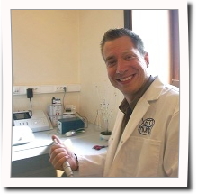

#### [Philippe Grosjean](http://phgrosjean.sciviews.org)

- Directeur du service, professeur
- Téléphone : +32-65.37.34.97 
- Email : Philippe.Grosjean@umons.ac.be)
- Liens : [C.V.](http://www.sciviews.org/_phgrosjean/CVfr.pdf), [thèse de doctorat](http://www.sciviews.org/_phgrosjean/These.pdf)

#### [Guyliann Engels](http://www.guyliann.be)

- Assistant & doctorant
- Mésocosmes artificiels et coraux
- Téléphone : +32-65.37.34.78
- Email : Guyliann.Engels@umons.ac.be

#### Antoine Batigny

- Technicien
- Animalier spécialiste en aquariologie marine tropicale
- Téléphone : +32-65.37.33.59 
- Email :  Antoine.Batigny@umons.ac.be

### Les anciens par ordre alphabétique :

- Achille Bonso (stagiaire 2008-2009)
- François Dendoncker (mémorant 2006-2007)
- Kevin Denis (doctorant & assistant de recherche 2005-2014)
- Olivier Detournay (post-doc 2007)
- Virginie Dudome (mémorante 2010-2011)
- Davy Fiankan (mémorant 2006-2007 ULB-UMH)
- Diana Galvez Lopez (mémorante ERASMUS 2005-2006)
- Pierre Govaerts (mémorant 2009-2010)
- Julien Leblud (assistant 2007-2015)
- Vincent Lhussier (mémorant 2005-2006)
- Hadrien Maloux (mémorant 2010-2011)
- Arnaud Michot (stagiaire 2005-2006)
- Laure Moulin (doctorante ULB-UMONS 2010-2014)
- Giulia Puleo (mémorante 2010-2011)
- Stéphanie Roosa (mémorante 2008-2009)
- Xavier Tezzo (mémorant 2007-2008 ULB-UMH)
- Devaragen Vaïtilingon (post-doc 2005).

<!--stackedit_data:
eyJoaXN0b3J5IjpbNTk0NTEwNjM3XX0=
-->
